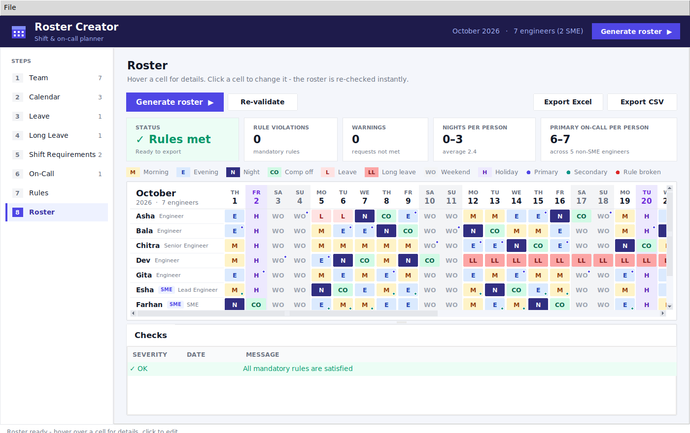
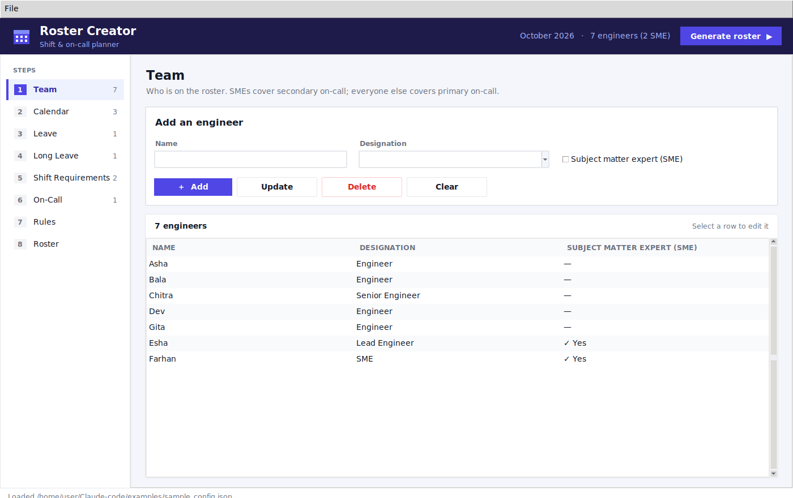
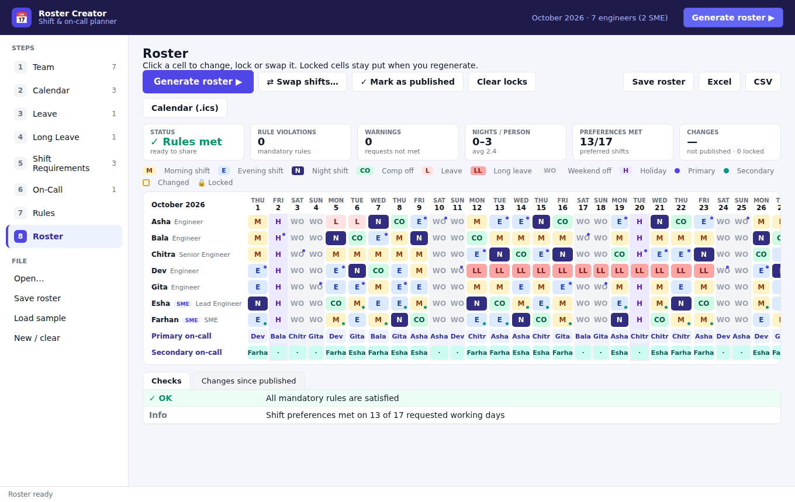

# Roster Creator

A desktop (Tkinter) tool that builds a monthly shift and on-call roster for an
engineering team. You enter the team, leave, shift requests and calendar, and
it generates a roster that meets the mandatory rules. Any rule it can't meet
is listed so you can fix it.





## Download and run (no installation needed)

Download the file for your computer. Python, Tkinter and the Excel library
are all bundled inside.

| System | Download | How to start |
| --- | --- | --- |
| 🪟 Windows | [**RosterCreator-Windows.exe**](https://github.com/Liku1376/Claude-code/releases/latest/download/RosterCreator-Windows.exe) | Double-click it. If SmartScreen says "Windows protected your PC", click **More info → Run anyway** (the app is not code-signed). |
| 🍎 macOS (Apple Silicon) | [**RosterCreator-macOS.zip**](https://github.com/Liku1376/Claude-code/releases/latest/download/RosterCreator-macOS.zip) | Unzip, then **right-click RosterCreator.app → Open → Open** the first time (the app is not notarised). |
| 🐧 Linux | [**RosterCreator-Linux**](https://github.com/Liku1376/Claude-code/releases/latest/download/RosterCreator-Linux) | `chmod +x RosterCreator-Linux && ./RosterCreator-Linux` |

These links always point to the newest release. All versions are on the
[Releases page](https://github.com/Liku1376/Claude-code/releases).

Use **File → Load sample data** to see a filled-in example, then press
**Generate roster** (top right).

## Run it as a local web app (no installation, no .exe)

If your computer blocks unknown executables, run the tool as a **local web
page** instead. It uses only Python's standard library — nothing to install —
and produces no executable file:

```bash
python roster_web.py
```



This starts a small server on your own machine and opens
`http://127.0.0.1:8765/` in your browser. The whole tool runs there, with the
same rules, generator, carry-over, swaps and exports as the desktop version.
Leave the terminal window open while you use it, and press Ctrl+C there to
stop. Options: `--port 9000` to change the port, `--no-browser` to not open a
browser automatically.

Nothing you enter leaves your machine: the server listens only on
`127.0.0.1` (localhost), so it is not reachable from the network.

In the web app, **Save roster** downloads a `.json` file and **Open** loads
one back; Excel, CSV and calendar (.ics) exports download as files.

### Publishing a new version

On GitHub, open **Actions → Build desktop app → Run workflow**, enter a
version such as `v1.1.0`, and click **Run workflow**. Pushing a tag such as
`v1.1.0` does the same. Either way, the workflow builds all three apps, tests
them and publishes them as a new release with a separate download for each
system.

### Building the app yourself

```bash
pip install -r requirements-build.txt
python build.py            # output in dist/
```

PyInstaller only builds for the system it runs on. To get a Windows `.exe`,
run this on Windows; to get the macOS app, run it on a Mac.

### Running from source

Needs Python 3.10+ with Tkinter. No other packages are required - Excel,
CSV and calendar exports all work with the standard library.

```bash
python roster_app.py
```

Installing `openpyxl` (`pip install -r requirements.txt`) is optional; when
present, Excel exports use it for slightly richer formatting.

To generate without the GUI, run
`python roster_cli.py examples/sample_config.json -o roster.xlsx`.
Add `--previous last_month_roster.json` for carry-over,
`--save roster.json` to save a roster file, and `--ics folder/` for calendar invites.

## Inputs (one step each in the left sidebar)

| Step | What you enter |
| --- | --- |
| 1. Team | Name, designation, and whether the engineer is an **SME** |
| 2. Calendar | Roster month/year, weekend days, holidays, freeze periods |
| 3. Leave | Engineer + date or date range (shown as `L`) |
| 4. Long Leave | Engineer + date range (shown as `LL`) |
| 5. Shift Requirements | Engineer + dates + Morning/Evening/Night + **Must** (always that shift), **Prefer** (that shift when the rules allow) or **Avoid** (never that shift, e.g. no nights) |
| 6. On-Call | Optional: fix the primary/secondary on-call engineer for a given day. Every other day is assigned automatically, rotating fairly |
| 7. Rules | Minimum engineers per shift for each day type, shift timings (for calendar invites), carry-over from last month, generator settings |

Every date field has a calendar button that opens a month view, with
weekends and holidays highlighted. You can also type dates as `YYYY-MM-DD`,
`DD/MM/YYYY`, or just the day number (e.g. `14`) within the selected month. Use **File → Save inputs** to save
everything as a JSON file you can reopen and reuse next month.

## Mandatory rules

1. **Coverage:** at least 1 engineer on Morning and 1 on Night on working days.
   Freeze periods, weekends and holidays are excluded. The minimums can be
   changed per day type on the Rules tab.
2. **Comp off:** every night shift earns a comp off (`CO`) on the **next
   working day**. Comp offs never fall on a weekend or holiday. After a
   Friday night, for example, the engineer is off over the weekend and takes
   the comp off on Monday. They get no shifts or on-call until then. If the
   comp off falls in the next month, it is flagged as a carry-over.
3. **Primary on-call** (every day, including weekends and holidays): a
   **non-SME** engineer who is **not** on Morning or Night shift that day.
   On working days they are on the Evening shift.
4. **Secondary on-call:** an **SME** engineer. Not needed on weekends and
   holidays.

The tool also honours leave, long leave and Must/Avoid shift requests. It
balances nights, mornings, evenings and on-call duty across the team.

## A month with Roster Creator

1. **Import last month (Rules → Carry-over, or File → Import previous month's roster).**
   Choose last month's saved roster file. This does two things:
   - Nights worked at the end of last month get their comp off at the start of this month.
   - Running totals of nights, shifts and on-call are carried over, so the rotation stays fair across months.
2. **Generate.** Before building the roster, the app checks whether there are
   enough people on each day. If there aren't, it lists the problem days (for
   example, "Only 3 engineers available but at least 4 needed") so you can
   adjust leave or the minimums first.
3. **Adjust.** Click any cell to:
   - change it (hand edits are locked automatically),
   - lock or unlock it,
   - swap it with another engineer.

   Locked cells (padlock icon) stay exactly as they are when you press
   **Generate** again, and everything else is rebuilt around them.
4. **Swap shifts** (toolbar or right side of the cell menu). Pick two engineers and a day.
   - The dialog shows exactly what changes and warns you if the swap would break a rule.
   - When a night shift changes hands, its comp off moves with it.
   - Swapped cells are locked.
5. **Mark as published** when you share the roster. From then on:
   - Every change is outlined in orange and listed under **Changes since published**.
   - **Copy list** copies the changes so you can paste them into an email or chat.
   - Pressing **Generate** again keeps the published roster wherever the rules allow, so only the necessary cells change.
6. **Share** the roster:
   - **Calendar (.ics)** writes one calendar file per engineer plus a team calendar. Each file covers shifts (with times), on-call, comp offs and leave, and opens in Outlook, Google Calendar or Apple Calendar.
   - Excel and CSV exports are still available.
7. **Save roster** (Ctrl+S). The roster file keeps everything: the inputs,
   your hand edits, locks and the published version. Reopen it any time with
   **File → Open** (Ctrl+O). Next month, import it for carry-over.

## Roster tab

- Summary tiles show:
  - whether all rules are met,
  - how many rules are broken and how many requests couldn't be met,
  - how evenly nights are spread, including previous months,
  - how many shift preferences were met,
  - how many cells changed since publishing.
- Cells are colour-coded: `M` Morning, `E` Evening, `N` Night, `CO` Comp off,
  `L` Leave, `LL` Long leave, `WO` Weekend off, `H` Holiday.
  - A small indigo dot marks primary on-call and a teal dot marks secondary on-call.
  - A padlock marks a locked cell, and an orange outline marks a cell changed since publishing.
  - Weekend, holiday and freeze columns are shaded.
- Hover over a cell to see details in the status bar. Days that break a rule
  get a red dot under the date.
- The **Checks** tab lists:
  - **Errors:** a mandatory rule is broken.
  - **Warnings:** a request couldn't be honoured.
  - **Info:** notes, such as the number of shift preferences met.

## How generation works

The generator fills the month day by day in priority order:

1. locked cells
2. leave and comp offs (including comp offs carried over from last month)
3. Must requests
4. primary on-call
5. secondary on-call
6. Night
7. Morning
8. Evening
9. everyone else, split between Morning and Evening (using their preferred shift if they have one)

When several engineers qualify, it picks the one with the fewest of that duty
so far, counting totals carried over from previous months. Preferred shifts
tip the balance, and after publishing, keeping the published assignment comes
first.

It does this for several hundred randomised attempts and keeps the best one:
fewest rule violations first, then fewest unmet requests, fewest changes
from the published roster, the most even workload and the most preferences
met. Set a random seed on the Rules tab to get the same roster every time.

## Development

```bash
pip install pytest openpyxl
python -m pytest
```

| Path | Purpose |
| --- | --- |
| `roster_tool/model.py` | Data model, input parsing, calendar helpers |
| `roster_tool/scheduler.py` | Roster generation |
| `roster_tool/validator.py` | Rule checks (used for generated and hand-edited rosters) |
| `roster_tool/export.py` | CSV / Excel export |
| `roster_tool/storage.py` | Roster files, carry-over, change tracking, swaps |
| `roster_tool/ics.py` | Calendar invite (.ics) export |
| `roster_tool/datepicker.py` | Calendar date picker |
| `roster_tool/gui.py` | Tkinter (desktop) user interface |
| `roster_tool/webapp.py` | Local web-app server (stdlib HTTP + JSON API) |
| `roster_tool/web/` | Web-app front end (HTML/CSS/JS) |
| `roster_tool/theme.py` | Colours, fonts and widget styles |
| `build.py` | Builds the standalone desktop app with PyInstaller |
| `.github/workflows/build.yml` | Builds, tests and releases the app for Windows, macOS and Linux |
